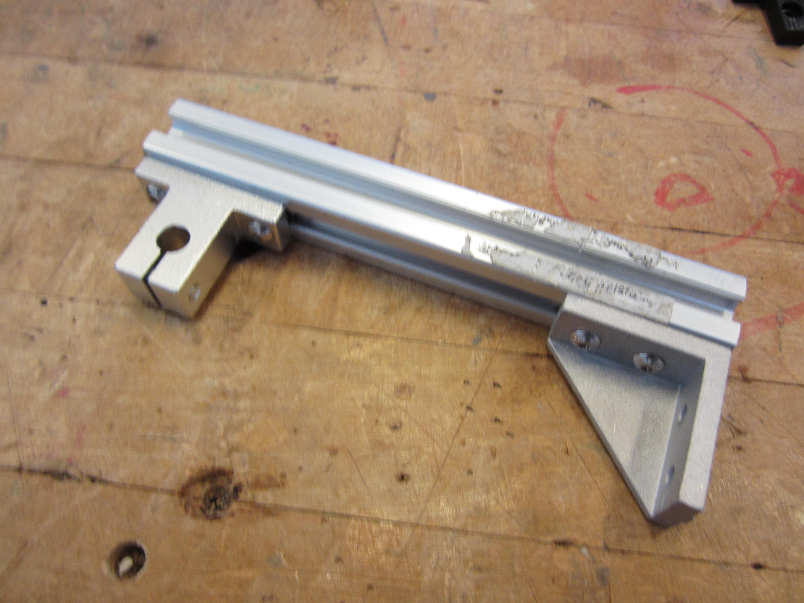

#How to Assemble the Gantry

##Parts Needed

##Steps
###Gantry:
Parts Needed: 

Part              | Quantity    | Image 
------------------|-------------|----------
Linear Rail Shaft | 4        |
Slotted Extrusions| width*2  |
Linear Bearing PLatform| 4   |
8mm rod           | length*2 |
M4 oval T nut     | 10       |
M4 10 mm Screw    | 10       |
Caster ball       | 2        |
3d Printed belt clamp| 2     |

1. Mount Linear Rail Shaft on extrusion
  - 
  - 
  - 
  - 
  - 
  - 
  - 
2. Slide the rods trhough the the linear rail shaft
3. slide 2 bearing platforms onto each
4. tighten it down
5. Caster balls
6. belt system

###Right Tower:
Part              | Quantity    | Image 
------------------|-------------|----------
Linear Rail Shaft | 1       |
Slotted Extrusions| ???     |
Linear Bearing PLatform| 1  |
3d printed mount for ^| 2   |
8mm rod           | ???     |
M4 oval T nut     | 10      |
M4 10 mm Screw    | 10      |

1. Attach a corner to the longer extrusion 
2. Attach rail shaft 
3. Attach a corner the shorter extrusion 
4. Mount the two extrusions together 
5. Assemble bearing assembly 
6. Mount bearing 

###Left Tower:
Part              | Quantity    | Image 
------------------|-------------|----------
Slotted Extrusions| ???     |
Stepper Motor     | 1       |
Stepper Mounting plate| 1   |
Gear assembly     | 1       |
8mm rod           | ???     |
M4 oval T nut     | 6       |
M4 10 mm Screw    | 6       |

1. Attach brackets to the extrusion 
2. Attach mounting plate to the extrusion 
3. Put bearings in 
4. Mount stepper and faceplate 
5. Add gears and rod 

###Base:
Part              | Quantity    | Image 
------------------|-------------|----------
Slotted Extrusions| ???     |
Stepper Motor     | 1       |
Stepper Mounting plate| 1   |
Gear assembly Print   | 1   |
Bearings          | 2       |

1. Assemble stepper assembly
  - 
  - 
  - 
  - 
  - 
2. Mount stepper assembly

###Electronics:
###Bringing it all together:
1. Mount Gantry to base.
2. Attach belt and run it through stepper assembly
3. Mount towers onto the sides of gantry
4. Attach electronics
